Kali ini saya akan menuliskan cara membuat *notes & password manager* dengan **Cryptomator** dan **Cloudflare R2**.  
Cryptomator berfungsi sebagai *encryptor*, sedangkan Cloudflare R2 berfungsi sebagai *cloud storage* untuk menyimpan notes & password.

Untuk penyimpanan data, saya memilih menggunakan [Cloudflare R2](https://www.cloudflare.com/developer-platform/r2/).  
Cloudflare R2 memiliki banyak keunggulan, seperti:
- Penyimpanan objek kompatibel dengan S3
- Tanpa biaya keluar (*egress fee*)
- Migrasi mudah

Berikut detail biaya di Cloudflare R2:

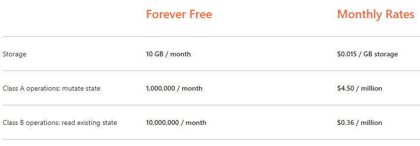

---

### 🚀 Langkah 1: Setup Cloudflare R2

Langsung saja kita mulai.

1. Buat akun di [Cloudflare](https://www.cloudflare.com/).  
   *(Saya asumsikan Anda sudah paham caranya.)*

2. Setelah login, Anda akan diarahkan ke dashboard seperti berikut:

   

3. Klik **R2** di sidebar kiri:

   

4. Klik tombol **Create bucket**:

   

5. Beri nama bucket — contoh: `notpad`.  
   Untuk lokasi, biarkan **Automatic**, lalu klik **Create bucket**.

   

6. Bucket berhasil dibuat. Klik **Settings**:

   

   > 💡 Karena kita pilih lokasi *Automatic*, data akan disimpan di region terdekat — dalam kasus ini: **Asia-Pacific (APAC)**.  
   > Kode `APAC` ini akan digunakan saat konfigurasi di Cryptomator.

7. Klik **Objects**, lalu **S3 Compatibility API**:

   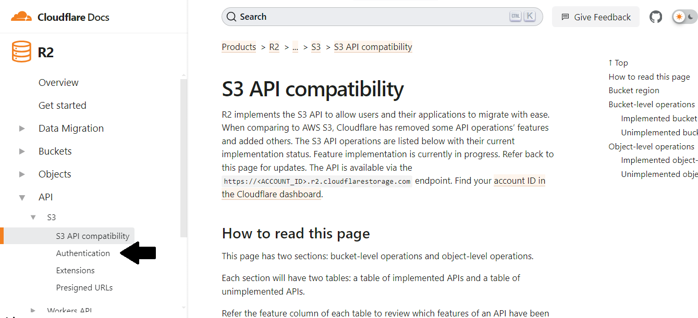

8. Klik **Authentication** → **Create API Token**:

     
   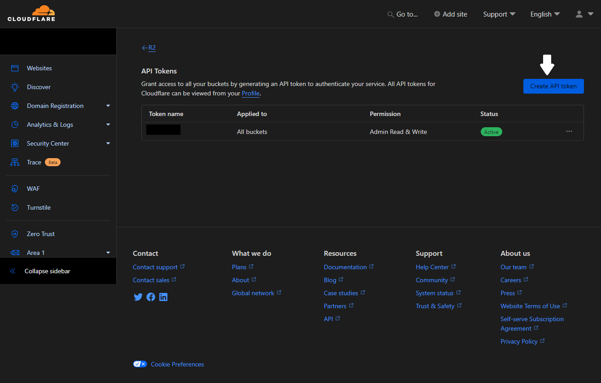

9. Klik **Create API Token**, lalu isi:
   - **Name**: `notpad` (atau sesuai keinginan)
   - **Permissions**: `Admin Read & Write`
   
   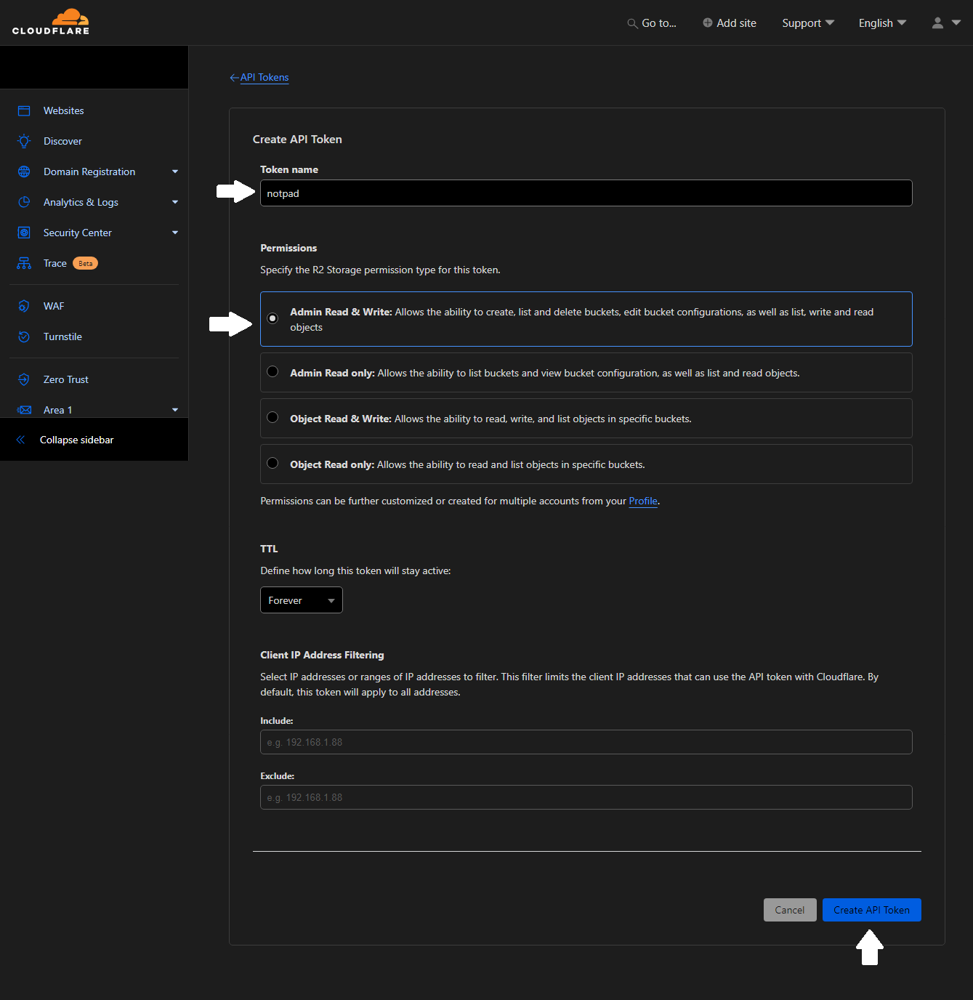

10. Klik **Create API Token** — Anda akan melihat kredensial:

    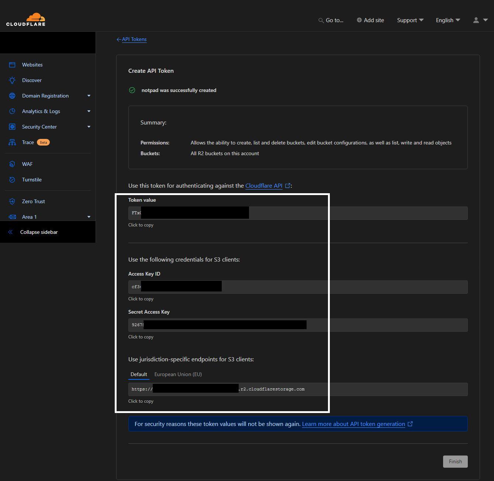

    > 🔒 **SANGAT PENTING**:  
    > - Salin dan simpan `Access Key ID`, `Secret Access Key`, dan `Endpoint`  
    > - Data ini hanya ditampilkan **sekali** — setelah klik *Finish*, tidak bisa dilihat lagi  
    > - Jangan sampai bocor — ini adalah kunci akses ke data Anda

---

### 🔐 Tentang Cryptomator

Sebelum lanjut, mari kenali [Cryptomator](https://cryptomator.org/):

- ✅ Open-source & end-to-end encrypted  
- ✅ Kompatibel dengan cloud storage apa pun (termasuk R2 via S3 API)  
- ✅ Tersedia untuk **Windows, macOS, Linux, Android, iOS**  
- ✅ Gratis di desktop; berbayar (*one-time*) di mobile

---

### 📱 Langkah 2: Setup di Cryptomator (Android)

> 📌 *Saya menggunakan Android — sesuaikan jika pakai platform lain.*

1. Install **Cryptomator** dari Play Store.

2. Buka aplikasi → tampilan awal:

   

3. Klik tombol **+** (pojok kanan bawah) → **Add existing vault**:

     
   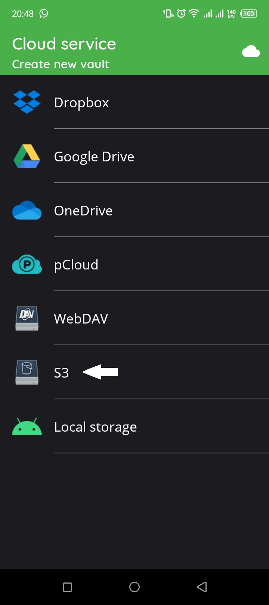

4. Pilih **S3**:

   

5. Klik **+** → isi kredensial dari Cloudflare tadi:

   | Field | Isi dari Cloudflare |
   |-------|---------------------|
   | **Name** | `notpad` (bebas) |
   | **Access Key ID** | `xxxxxxxxxxxxx` |
   | **Secret Access Key** | `xxxxxxxxxxxxxxxxxxxxxxxx` |
   | **Endpoint** | `https://<account-id>.r2.cloudflarestorage.com` |
   | **Region** | `APAC` *(atau sesuai region bucket Anda)* |

   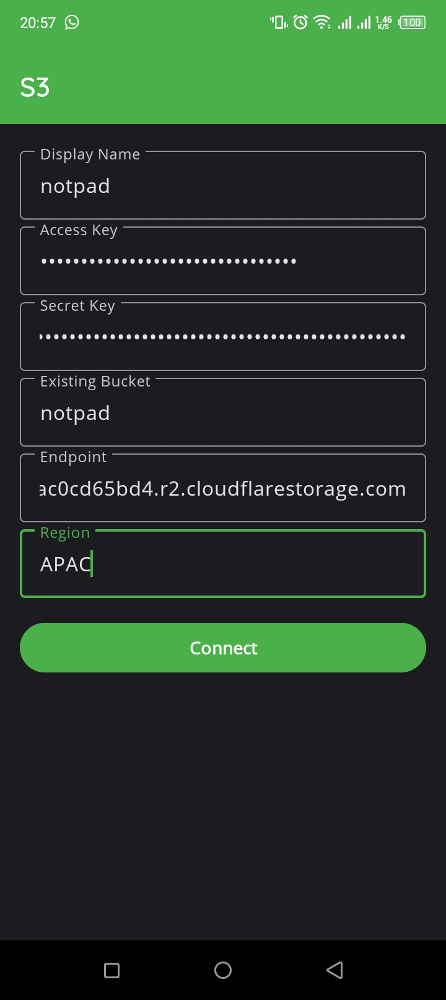

6. Klik **Connect** → pilih bucket `notpad` → **Place here**:

   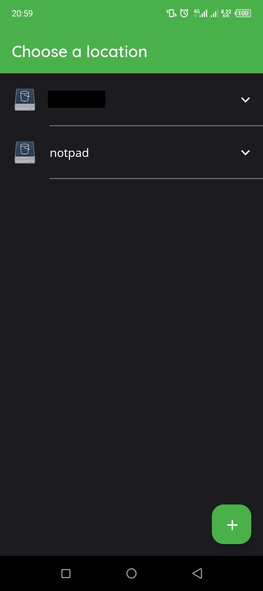  
   

7. Buat **kata sandi vault** (tidak ada *reset* — simpan baik-baik!):

   

8. Vault berhasil dibuat:

   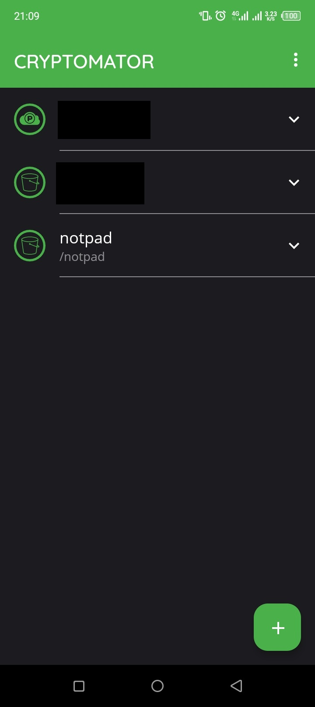

9. Kembali ke daftar vault → pilih `notpad` → masukkan password → **Unlock**:

   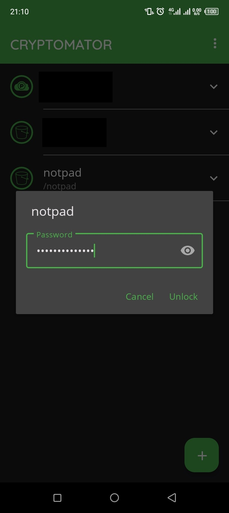  
   

---

### ✍️ Membuat Catatan & Menyimpan Data

Sekarang vault terbuka — Anda bisa:

- 📄 **Buat file teks**  
- 📁 **Buat folder**  
- 📤 **Upload file** (password, PDF, dll)

Contoh: buat file `Akun.txt`:

1. Klik **+** → **Create text file**  
2. Beri nama `Akun.txt` → **Create**  
3. Ketik konten → klik **ikon save** (pojok kanan atas)

     
     
   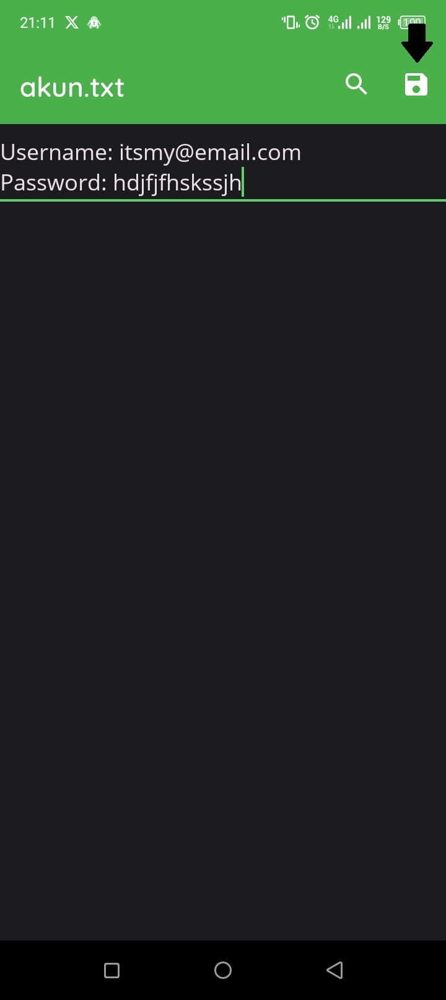  
   

> 💡 Setiap perubahan otomatis:  
> - Di-**enkripsi lokal** oleh Cryptomator  
> - Di-**upload ke R2** via S3 API  
> - Aman dari akses Cloudflare, pihak ketiga, atau peretas

---

### 🔍 Verifikasi di Cloudflare R2

Buka kembali dashboard R2 — Anda akan melihat struktur seperti ini:

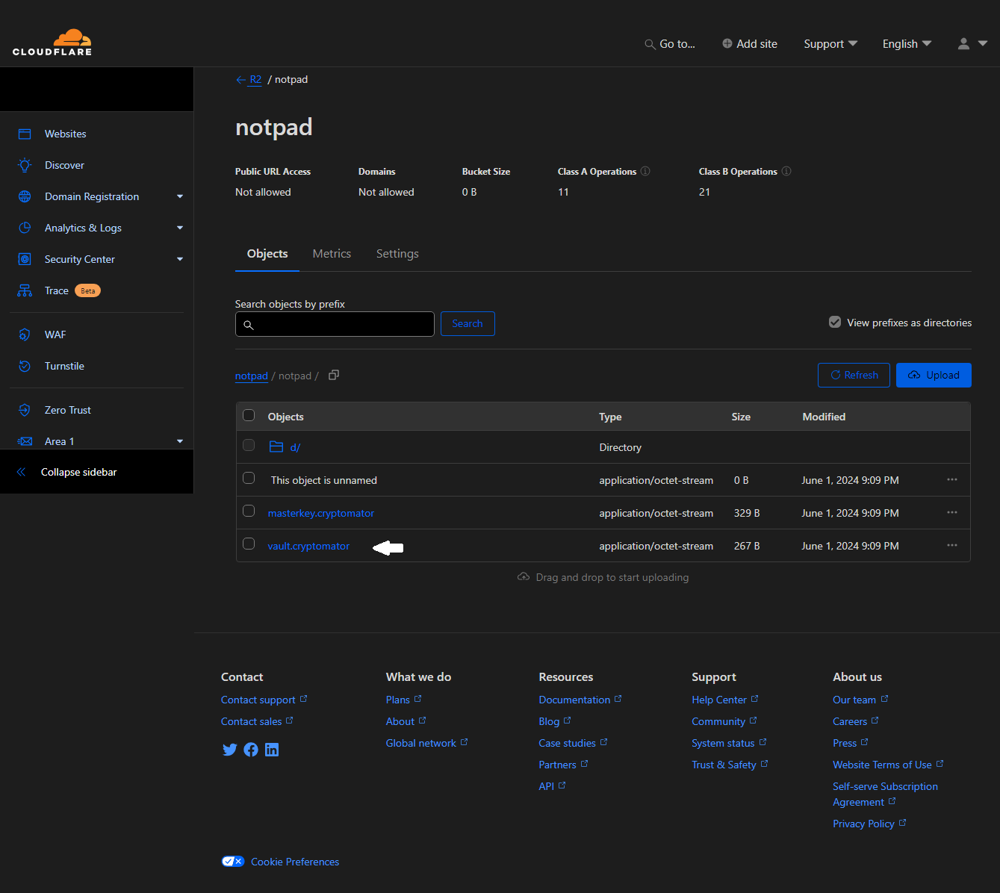

- File terenkripsi (nama acak, struktur direktori khusus)  
- File `vault.cryptomator` → berisi metadata & kunci enkripsi  
- **Tidak ada teks terbaca** — bahkan oleh pemilik bucket sekalipun tanpa password

---

### ✅ Selesai!

Anda kini memiliki:
- 🔐 **Password manager** yang 100% privat  
- 📝 **Notes pribadi** yang aman dari akses luar  
- ☁️ Penyimpanan di cloud dengan biaya rendah & kecepatan tinggi  
- 🔄 Sinkronisasi otomatis antar perangkat (jika install Cryptomator di desktop juga)

> Terima kasih telah mengikuti tutorial ini.  
> Sampai jumpa di catatan berikutnya! 🛡️

---

**Catatan Keamanan Tambahan**:  
- Jangan simpan password vault di tempat yang tidak aman  
- Backup `vault.cryptomator` secara berkala (file ini dibutuhkan untuk *recovery*)  
- Gunakan 2FA di akun Cloudflare