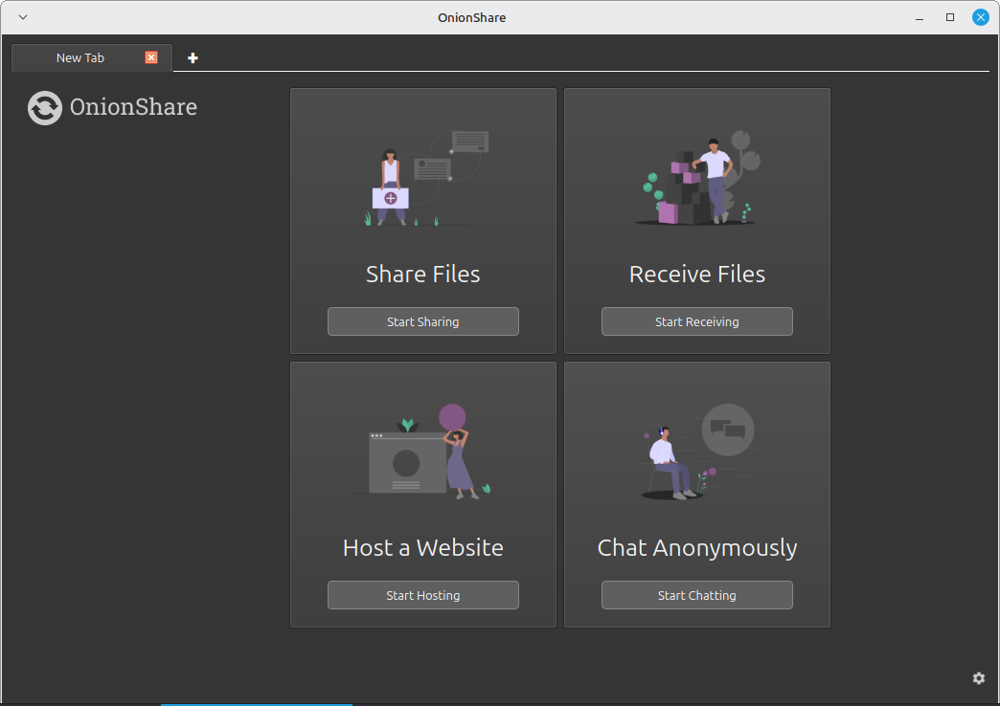
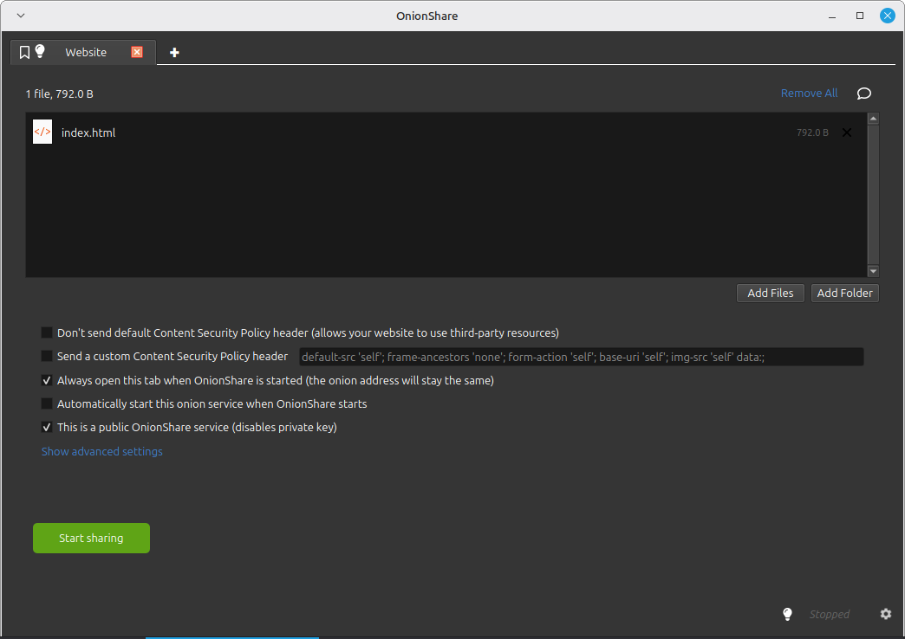
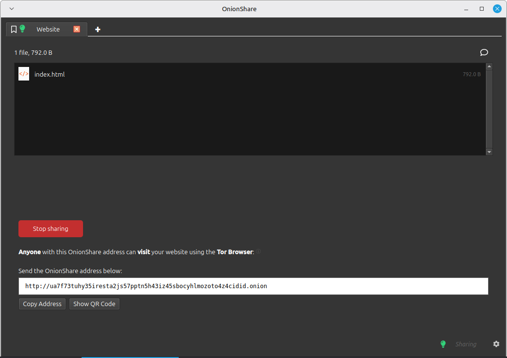

Kali ini saya akan menuliskan cara menghosting situs web anonim di **Jaringan TOR**.  
Kita akan menggunakan:
- 🧅 **OnionShare** → untuk menghosting situs  
- 🌐 **Tor Browser** → untuk mengakses situs

---

### 🧅 Apa Itu Jaringan TOR?

**TOR** (*The Onion Router*) adalah sistem jaringan komunikasi terenkripsi yang dirancang untuk menjaga anonimitas pengguna saat berselancar di internet.

Cara kerjanya:
- Lalu lintas diarahkan melalui **serangkaian relay (node)** di seluruh dunia  
- Setiap node hanya tahu identitas node **sebelum** dan **sesudah**nya  
- Data dienkripsi berlapis — seperti kulit bawang (*onion*) — dibuka satu per satu di tiap relay  
- Hasil: identitas & aktivitas Anda **tidak bisa dilacak**, bahkan oleh ISP atau pemerintah

TOR sering digunakan untuk:
- Melindungi privasi  
- Mengakses informasi yang diblokir  
- Berkomunikasi aman di wilayah dengan sensor ketat

---

### 📤 Apa Itu OnionShare?

[OnionShare](https://onionshare.org/) adalah aplikasi **open-source** yang memungkinkan Anda:
- Berbagi file  
- Menghosting situs web  
- Mengobrol secara anonim  
→ **Semua melalui jaringan TOR**

Keunggulan utama:
- ✅ Tidak pakai server pihak ketiga — file dikirim **langsung dari perangkat Anda**  
- ✅ Alamat `.onion` hanya bisa diakses via Tor Browser  
- ✅ Enkripsi end-to-end  
- ✅ Cocok untuk jurnalis, aktivis, atau siapa pun yang butuh keamanan ekstra

---

### 🚀 Langkah 1: Setup OnionShare

1. Unduh & install [OnionShare](https://onionshare.org/) (tersedia untuk Windows, macOS, Linux).  
2. Buka aplikasi — tampilan awal:

   

3. Klik **Connect to Tor** → tunggu hingga berhasil:

   

4. Klik **Start Hosting**:

   

5. Klik **Add Files** → pilih file `index.html` yang sudah Anda buat.  
   *(Contoh source code `index.html` saya:)*

   

6. Setelah file ditambahkan, atur opsi:
   - ✅ **Always open this tab when OnionShare is started**  
     → Agar alamat `.onion` tidak berubah tiap restart  
   - ✅ **This is a public OnionShare service**  
     → Agar tidak perlu kunci akses (untuk situs publik)

   

7. Klik **Start sharing** → tunggu hingga aktif:

   

   > 🎉 Situs kini aktif!  
   > Catat alamat `.onion` yang muncul — ini adalah URL akses Anda.

---

### 🌐 Langkah 2: Akses via Tor Browser

1. Unduh & install [Tor Browser](https://www.torproject.org/) (tersedia untuk desktop & Android).  
2. Buka aplikasi → klik **Connect**:

     
   

3. Di address bar, tempel alamat `.onion` Anda.  
   ⚠️ Pastikan URL berawal dengan **`http://`** (*bukan* `https://` — OnionShare tidak pakai SSL).

4. Tekan Enter → tunggu beberapa detik hingga halaman muncul:

   

> ⏳ **Catatan**: Akses di TOR memang lebih lambat — karena lalu lintas melewati 3+ node relay. Ini adalah *trade-off* untuk anonimitas.

---

### 🛠️ Fitur Lain OnionShare

Selain menghosting situs, OnionShare juga bisa:
- 📤 **Kirim file** (aman, tanpa upload ke cloud)  
- 📥 **Terima file** (dari siapa pun, tanpa email)  
- 💬 **Obrolan anonim** (tanpa log, tanpa akun)

Semua fitur ini **tidak meninggalkan jejak digital** dan tidak bergantung pada pihak ketiga.

---

### ✅ Selesai!

Anda kini bisa:
- Membuat situs anonim dalam 5 menit  
- Berbagi informasi sensitif tanpa takut disadap  
- Melindungi identitas dari pengawasan massal

> Terima kasih telah mengikuti tutorial ini.  
> Sampai jumpa di catatan berikutnya! 🧅

---

**Tips Tambahan**:
- Gunakan Tor Browser versi terbaru untuk keamanan maksimal  
- Jangan nonaktifkan JavaScript kecuali benar-benar diperlukan  
- Hindari membuka konten non-TOR saat menggunakan Tor Browser (gunakan *New Identity* jika perlu)