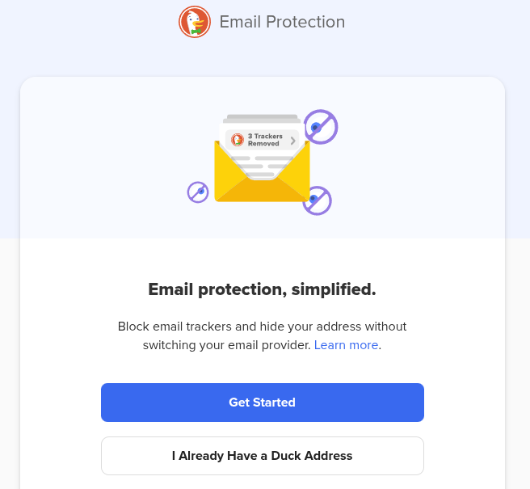

Di era digital, alamat email bukan sekadar sarana komunikasi —  
**ia adalah identitas utama** yang menghubungkan Anda dengan:
- Belanja daring  
- Media sosial  
- Perbankan  
- Layanan pemerintah  
- Dan ratusan akun lainnya

Namun, identitas ini kerap **dieksploitasi tanpa sepengetahuan Anda**.

Menurut data dari [DuckDuckGo](https://duckduckgo.com/email),  
> **85% email yang diterima** dalam uji coba *Email Protection*  
> mengandung **pelacak tersembunyi** yang mampu merekam:
> - Kapan email dibuka  
> - Dari lokasi mana  
> - Perangkat apa yang digunakan  

Informasi ini lalu dipakai untuk:
- Membangun profil perilaku  
- Menayangkan iklan bertarget  
- Bahkan melacak Anda **setelah berhenti berinteraksi** dengan layanan tersebut.

---

### 🛡️ Solusi: DuckDuckGo Email Protection

[DuckDuckGo Email Protection](https://duckduckgo.com/email) adalah layanan **gratis** yang melindungi privasi email Anda — **tanpa mengorbankan kenyamanan**.

#### Fitur Utama:
| Fitur | Penjelasan |
|-------|------------|
| ✅ **Email Forwarding** | Terima email di `@duck.com` → diteruskan ke inbox utama Anda |
| ✅ **Pelacak Dihapus Otomatis** | Tracking pixels, skrip, dan tautan identifikasi dihilangkan sebelum email sampai |
| ✅ **Email Masking** | Buat alamat privat unik (`nama@duck.com`) untuk tiap layanan — alamat asli Anda tetap tersembunyi |
| ✅ **Zero-Knowledge** | DuckDuckGo **tidak menyimpan konten email**, **tidak melacak aktivitas**, dan **tidak menjual data** |

> 🗣️ Prinsip mereka:  
> **“Your emails are none of our business!”**

---

### 🚀 Cara Menggunakan

1. Buka [https://duckduckgo.com/email](https://duckduckgo.com/email)  
   *(Jika tidak pakai DuckDuckGo Browser, **wajib install ekstensi DuckDuckGo** dulu.)*

2. Klik tombol sesuai kebutuhan:
   - **Get Started** → buat alamat `@duck.com` baru  
   - **I Already Have a Duck Address** → ubah email utama

   

---

### 📤 Mengirim Email dengan Alamat Duck

> ⚠️ **Penting**: Mengirim *ke orang lain* memerlukan format khusus.

Misal:
- Alamat Duck Anda: `bryan@duck.com`  
- Ingin kirim ke: `bahlil@gmail.com`

Maka, **alamat tujuan harus ditulis sebagai**: `bahlil_at_gmail.com_bryan@duck.com`

> 💡 **Tips mudah mengingat**:
> 1. Ganti `@` pada email tujuan → jadi `_at_`  
> 2. Ganti `.` → jadi `_`  
> 3. Tambahkan `_bryan@duck.com` di akhir (ganti `bryan` dengan *username* Duck Anda)

Contoh lain:
- Tujuan: `admin@tokopedia.com`, Duck: `jeannes@duck.com`  
  → Tulis: `admin_at_tokopedia_com_jeannes@duck.com`

✅ **Catatan penting**:
- 🔁 **Membalas email** → lakukan seperti biasa (tidak perlu format khusus)  
- 📥 **Menerima email** → otomatis, tanpa konfigurasi tambahan

---

### 💡 Mengapa Ini Penting?

DuckDuckGo Email Protection bukan sekadar *anti-spam*.  
Ia adalah **alat pemberdayaan digital** yang memungkinkan Anda:

- 🔒 Lindungi inbox dari pengawasan diam-diam  
- 🧩 Pisahkan identitas online per layanan (e-commerce ≠ medsos ≠ fintech)  
- 🚫 Hentikan pembentukan profil perilaku tanpa izin  
- 🌐 Gunakan internet dengan lebih bebas — tanpa takut dijejak

Dan yang terbaik?  
➡️ **Gratis. Tanpa iklan. Tanpa syarat tersembunyi.**

---

> Terima kasih telah membaca.  
> Semoga semakin banyak orang yang sadar: **privasi bukan kemewahan — ia adalah hak dasar di era digital.**

— Jeannes Bryan 🦆